# scRNA-seq Analysis 

**Summary:**
 This pipeline performs comprehensive preprocessing, quality control, dimensionality reduction, clustering, and cell type annotation of single-cell RNA-seq data from a mouse lung immune profiling study. The data includes three experimental groups—**PBS**, **Ad5_prowt**, and **STing**—processed using the **Seurat** framework and enhanced with `miQC` for high-confidence cell filtering. The merged filtered object is subjected to multiple dimensionality reduction methods (UMAP, t-SNE, PHATE, ForceAtlas2, LargeVis, openTSNE), followed by unsupervised clustering and manual annotation based on canonical markers. The code further visualizes gene expression patterns across major cell types including epithelial, endothelial, stromal, myeloid, lymphoid, and B/T lineage populations. Differential gene expression markers are identified for each cluster, and customized annotations are used to define transcriptionally distinct subpopulations. The output includes publication-quality dot plots and dimensionality reduction plots, enabling downstream exploration of immune and stromal heterogeneity across conditions.

1. **Integrated Analysis and Annotation of  Single-Cell Transcriptomic Data from Mouse scRNA-seq Cohort**

~~~R
suppressPackageStartupMessages({
    library(dplyr)
    library(Seurat)
    library(Matrix)
    library(proxy)
    library(gplots)
    library(Rtsne)
    library(densityClust)
    library(irlba)
    library(monocle)
    library(plyr)
    library(DOSE)
    library(clusterProfiler)
    library(topGO)
    library(pathview)
    library(AnnotationDbi)
    library(cowplot)
    library(ggplot2)
    library(velocyto.R)
    library(trqwe)
    library(Rsamtools)
    library(GenomicFeatures)
    library(GenomicAlignments)
    library(BiocParallel)
    library(pheatmap)
    library(RColorBrewer)
    library(PoiClaClu)
    library(org.Mm.eg.db)
    library(org.Hs.eg.db)
    library(DESeq2)
    library(data.table)
    library(stringr)
    library(iTALK)
    library(nichenetr)
    library(tidyr)
    library(GenomicRanges)
    library(viridis)
    library(chromVAR)
    library(ggpubr)
    library(corrplot)
    library(SingleCellExperiment)
    library(scater)
    library(flexmix)
    library(splines)
    library(biomaRt)
    library(miQC)
    library(scales)
    library(BuenColors)
    library(PCAtools)
    library(Seurat)
    library(SeuratData)
    library(SeuratWrappers)
    library(flexmix)
})
source("./MyBestFunction_scRNA.R.v4.R")
library(future)
library(future.apply)
options(future.globals.maxSize = 200 * 1024^3)
plan("multicore", workers = 60)
plan()
require(rJava)
require(xlsx)

dir.create("./projects/HWQ/scOmics/output")
scADT_data <- list.files(path = "./projects/HWQ/scOmics/res",full.names = TRUE)
sample <- c("Ad5_prowt","Ad5_prowt_BCR","Ad5_prowt_TCR","PBS","PBS_BCR","PBS_TCR","STing","STing_BCR","STing_TCR")
names(scADT_data) <- sample
scADT_data <- scADT_data[c("PBS","Ad5_prowt","STing")]
All_data <- lapply(1:length(scADT_data),function(x) {
    counts <- Read10X(data.dir = paste0(scADT_data[[x]],"/filtered_feature_bc_matrix/"))
    colnames(counts) <- paste(names(scADT_data)[x],colnames(counts),sep="_")
    scRNA_scADT <- CreateSeuratObject(counts = counts, min.cells = 3, min.features = 200,project = names(scADT_data)[x])
    mito.features <- grep(pattern = "^mt-", x = rownames(x = scRNA_scADT), value = TRUE)
    percent.mt <- Matrix::colSums(x = GetAssayData(object = scRNA_scADT, slot = "counts")[mito.features,])/Matrix::colSums(x = GetAssayData(object = scRNA_scADT, slot = "counts"))
    scRNA_scADT[["percent.mt"]] <- percent.mt
    scRNA_scADT <- RunMiQC(scRNA_scADT, percent.mt = "percent.mt", nFeature_RNA = "nFeature_RNA", posterior.cutoff = 0.99, model.slot = "flexmix_model", model.type = "spline")
    scRNA_scADT_filter <- subset(scRNA_scADT,miQC.keep=="keep")
    plot_Model <- PlotMiQC(scRNA_scADT, color.by = "miQC.probability") + ggplot2::scale_color_gradient(low = "grey", high = "purple")+ labs(title=names(scADT_data)[x])
    plot_Filter <- PlotMiQC(scRNA_scADT, color.by = "miQC.keep")+ labs(title=names(scADT_data)[x])
    scRNA_scADT_filter$sample <- names(scADT_data)[x]
    message(x,names(scADT_data)[x]," has been removed ", ncol(scRNA_scADT)-ncol(scRNA_scADT_filter)," from ",ncol(scRNA_scADT))
    return(list(scRNA_scADT,scRNA_scADT_filter,plot_Model,plot_Filter))
    })
mcsaveRDS(All_data,"./projects/HWQ/scOmics/output/All_data_seurat.rds",mc.cores=20)
# PBS has been removed 544 from 16284
# Ad5_prowt has been removed 446 from 18646
# STing has been removed 487 from 16286
~~~

~~~R
plot_Model_All <- lapply(1:length(All_data),function(x) {return(All_data[[x]][[3]])})
plot_Filter_All <- lapply(1:length(All_data),function(x) {return(All_data[[x]][[4]])})
CombinePlots(c(plot_Model_All,plot_Filter_All),ncol=3)
~~~

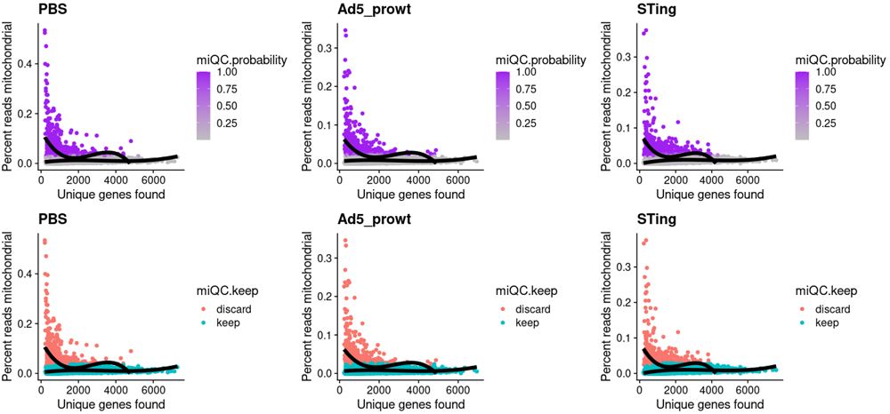

~~~r
All_sum_ <- lapply(1:length(All_data),function(x) {
    tmp_df <- as.data.frame(FetchData(object = All_data[[x]][[2]], vars = c("nFeature_RNA","nCount_RNA","percent.mt","sample","group"),slot="data"))
    return(tmp_df)
    })
All_sum <- do.call(rbind,All_sum_)
All_sum$log2_nCount_RNA <- log(All_sum$nCount_RNA+1,2)
Sel_g <- c("nFeature_RNA","log2_nCount_RNA","percent.mt")
All_sum$sample <- factor(All_sum$sample,levels=c("PBS","Ad5_prowt","STing"))
plot1 <- list()
for (i in 1:length(Sel_g)){
  plot1[[i]] <- ggviolin(All_sum, "sample", Sel_g[i], fill = "sample",legend = "none",rotate=TRUE,
   add = "boxplot", add.params = list(fill = "white"),title=paste0(Sel_g[i]," in All"))
}
plot2 <- list()
for (i in 1:length(Sel_g)){
  plot2[[i]] <- ggbarplot(All_sum, x = "sample", y = Sel_g[i],
    add = c("mean_se"),legend = "none",rotate=TRUE,
    color = "sample", fill = "sample", alpha = 1,title=paste0(Sel_g[i]," in All"))
}
CombinePlots(c(plot1,plot2),ncol=3)
~~~

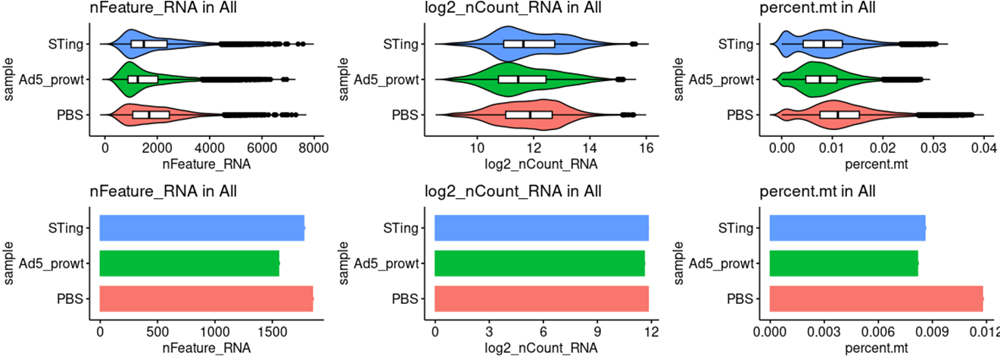

~~~R
sample_num <- as.data.frame(table(All_sum$sample))
ggbarplot(sample_num, x = "Var1", y = "Freq",
    add = c("mean_se"),legend = "none",rotate=TRUE,
    color = "Var1", fill = "Var1", alpha = 1,title="Cell num in All")
~~~

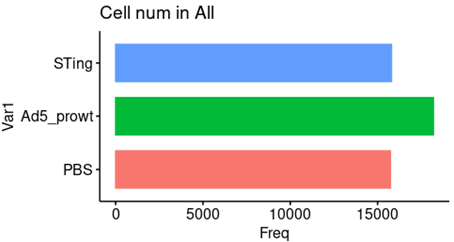

~~~R
scRNA_scADT_filter_merge <- merge(All_data[[1]][[2]],lapply(2:length(All_data),function(x) {return(All_data[[x]][[2]])}))
reticulate::use_python("/usr/local/python3.8/bin/python3.8", required=T)
library(reticulate)
library(ReductionWrappers)
library(s2a)
scRNA_scADT_filter_merge <- scRNA_scADT_filter_merge %>%
    NormalizeData(verbose = FALSE) %>%
    FindVariableFeatures(selection.method = "vst", nfeatures = 4000) %>% 
    ScaleData(verbose = TRUE)
scRNA_scADT_filter_merge1 <- scRNA_scADT_filter_merge %>% 
    RunPCA(pc.genes = scRNA_scADT_filter_merge@var.genes, npcs = 30, verbose = FALSE) %>% 
    RunUMAP(dims = 1:25) %>% 
    RunTSNE(dims = 1:25) %>% 
    FindNeighbors(dims = 1:25) %>% 
    FindClusters(resolution = c(0.1,0.2,0.4,1)) %>%
    DoopenTSNE(reduction_save = "openTSNE",dims_use = 1:25)
library(SCP)
scRNA_scADT_filter_merge1 <- RunLargeVis(scRNA_scADT_filter_merge1,reduction = "pca",dims = 1:25,assay = "RNA",reduction.name = "largevis",verbose = TRUE)
scRNA_scADT_filter_merge1 <- RunPHATE(scRNA_scADT_filter_merge1,reduction = "lsi",dims = 1:25,assay = "RNA",features=scRNA_scADT_filter_merge1@assays$RNA@var.features,knn = 5,decay = 40,reduction.name = "phate",verbose = TRUE,n_jobs = -1)
scRNA_scADT_filter_merge1 <- scRNA_scADT_filter_merge1 %>% DoForceAtlas2(reduction_save = "fa2",dims_use = 1:25)
mcsaveRDS(scRNA_scADT_filter_merge1,"./projects/HWQ/scOmics/output/scRNA_filter_merge1.rds",mc.cores=20)
~~~

~~~r

scRNA_filter_merge$v2_Cell_annotation <- as.character(scRNA_filter_merge$RNA_snn_res.1)
scRNA_filter_merge$v2_Cell_annotation[which(scRNA_filter_merge$v2_Cell_annotation=="0")] <- "Ighm+Bm"
scRNA_filter_merge$v2_Cell_annotation[which(scRNA_filter_merge$v2_Cell_annotation=="1")] <- "Tregs"
scRNA_filter_merge$v2_Cell_annotation[which(scRNA_filter_merge$v2_Cell_annotation=="2")] <- "Airway_epi"
scRNA_filter_merge$v2_Cell_annotation[which(scRNA_filter_merge$v2_Cell_annotation=="3")] <- "CD8T_prol"
scRNA_filter_merge$v2_Cell_annotation[which(scRNA_filter_merge$v2_Cell_annotation=="4")] <- "CD8Tem"
scRNA_filter_merge$v2_Cell_annotation[which(scRNA_filter_merge$v2_Cell_annotation=="5")] <- "Alv_Fibro"
scRNA_filter_merge$v2_Cell_annotation[which(scRNA_filter_merge$v2_Cell_annotation=="6")] <- "Neutrophil"
scRNA_filter_merge$v2_Cell_annotation[which(scRNA_filter_merge$v2_Cell_annotation=="7")] <- "Marco"
scRNA_filter_merge$v2_Cell_annotation[which(scRNA_filter_merge$v2_Cell_annotation=="8")] <- "Monocyte"
scRNA_filter_merge$v2_Cell_annotation[which(scRNA_filter_merge$v2_Cell_annotation=="9")] <- "Marco"
scRNA_filter_merge$v2_Cell_annotation[which(scRNA_filter_merge$v2_Cell_annotation=="10")] <- "Marco"
scRNA_filter_merge$v2_Cell_annotation[which(scRNA_filter_merge$v2_Cell_annotation=="11")] <- "Capillary"
scRNA_filter_merge$v2_Cell_annotation[which(scRNA_filter_merge$v2_Cell_annotation=="12")] <- "Monocyte"
scRNA_filter_merge$v2_Cell_annotation[which(scRNA_filter_merge$v2_Cell_annotation=="13")] <- "CD8T_prol"
scRNA_filter_merge$v2_Cell_annotation[which(scRNA_filter_merge$v2_Cell_annotation=="14")] <- "Adv_Fibro"
scRNA_filter_merge$v2_Cell_annotation[which(scRNA_filter_merge$v2_Cell_annotation=="15")] <- "pDC"
scRNA_filter_merge$v2_Cell_annotation[which(scRNA_filter_merge$v2_Cell_annotation=="16")] <- "Mesothelial"
scRNA_filter_merge$v2_Cell_annotation[which(scRNA_filter_merge$v2_Cell_annotation=="17")] <- "gdT"
scRNA_filter_merge$v2_Cell_annotation[which(scRNA_filter_merge$v2_Cell_annotation=="18")] <- "DC1"
scRNA_filter_merge$v2_Cell_annotation[which(scRNA_filter_merge$v2_Cell_annotation=="19")] <- "Igha+Plasma"
scRNA_filter_merge$v2_Cell_annotation[which(scRNA_filter_merge$v2_Cell_annotation=="20")] <- "Smooth_Muscle"
scRNA_filter_merge$v2_Cell_annotation[which(scRNA_filter_merge$v2_Cell_annotation=="21")] <- "ILC1"
scRNA_filter_merge$v2_Cell_annotation[which(scRNA_filter_merge$v2_Cell_annotation=="22")] <- "Naive.T"
scRNA_filter_merge$v2_Cell_annotation[which(scRNA_filter_merge$v2_Cell_annotation=="23")] <- "Ccr7_DC"
scRNA_filter_merge$v2_Cell_annotation[which(scRNA_filter_merge$v2_Cell_annotation=="24")] <- "Alv_Fibro"
scRNA_filter_merge$v2_Cell_annotation[which(scRNA_filter_merge$v2_Cell_annotation=="25")] <- "Marco"
scRNA_filter_merge$v2_Cell_annotation[which(scRNA_filter_merge$v2_Cell_annotation=="26")] <- "Club"
scRNA_filter_merge$v2_Cell_annotation[which(scRNA_filter_merge$v2_Cell_annotation=="27")] <- "Ighm+Bm"

scRNA_filter_merge$v2_Cell_annotation[which(scRNA_filter_merge$v2_Cell_annotation=="28")] <- "Tregs"
scRNA_filter_merge$v2_Cell_annotation[which(scRNA_filter_merge$v2_Cell_annotation=="29")] <- "Igha+Plasma"
scRNA_filter_merge$v2_Cell_annotation[which(scRNA_filter_merge$v2_Cell_annotation=="30")] <- "Ciliated"
scRNA_filter_merge$v2_Cell_annotation[which(scRNA_filter_merge$v2_Cell_annotation=="31")] <- "DC1"
scRNA_filter_merge$v2_Cell_annotation[which(scRNA_filter_merge$v2_Cell_annotation=="32")] <- "Marco"
scRNA_filter_merge$v2_Cell_annotation[which(scRNA_filter_merge$v2_Cell_annotation=="33")] <- "Lymphatic"
scRNA_filter_merge$v2_Cell_annotation[which(scRNA_filter_merge$v2_Cell_annotation=="34")] <- "AT2"
scRNA_filter_merge$v2_Cell_annotation[which(scRNA_filter_merge$v2_Cell_annotation=="35")] <- "Adv_Fibro"
scRNA_filter_merge$v2_Cell_annotation[which(scRNA_filter_merge$v2_Cell_annotation=="36")] <- "Igha+Plasma"
scRNA_filter_merge$v2_Cell_annotation[which(scRNA_filter_merge$v2_Cell_annotation=="37")] <- "Ighm+Bm"
scRNA_filter_merge$v2_Cell_annotation[which(scRNA_filter_merge$v2_Cell_annotation=="38")] <- "Ighm+Bm"
scRNA_filter_merge$v2_Cell_annotation[which(scRNA_filter_merge$v2_Cell_annotation=="39")] <- "Basal"
scRNA_filter_merge$v2_Cell_annotation[which(scRNA_filter_merge$v2_Cell_annotation=="40")] <- "Ighm+Bm"
scRNA_filter_merge$v2_Cell_annotation[which(scRNA_filter_merge$v2_Cell_annotation=="41")] <- "Neutrophil"
CT <- c("Igha+Plasma","Ighm+Bm","Adv_Fibro","Airway_epi","Alv_Fibro","AT2",
	"Basal","Capillary","Ccr7_DC","CD8T_prol","CD8Tem","Ciliated","Club","DC1","gdT","ILC1","Lymphatic",
	"Marco","Mesothelial","Monocyte","Naive.T","Neutrophil","pDC","Smooth_Muscle","Tregs")
setdiff(unique(scRNA_filter_merge$v2_Cell_annotation),CT)

scRNA_filter_merge$v2_Cell_annotation <- factor(scRNA_filter_merge$v2_Cell_annotation,levels=CT)

Plasma <- c("Igha", "Slamf7","Prdm1","Sdc1")
Bm <- c("Ighm","Hhex", "Tie3","Irf8","Cd19","Sell")
Adv_Fibro <- c("Serpinf1", "Pi16", "Entpd2")
Airway_epi <- c("Chil3","Krt79","Krt19")
Alv_Fibro <- c("Fgfr4", "Slc7a10", "Slc38a5")
AT2 <- c("Sftpc", "Muc1", "Etv5")
Basal <- c("Krt5", "Trp63", "Dapl1")
Capillary <- c("Ednrb", "Prx", "Cd93")
Ccr7_DC <- c("Ccr7")
CD8T_prol <- c("Cd8a","Cd8b","Mki67", "Top2a", "Cdk1")
CD8Tem <- c("Eomes","Gzmk","Cxcr3","Fgfbp2","Klrd1")
Ciliated <- c("Foxj1", "Ccdc78", "Fam183b")
Club <- c("Scgb3a2", "Cyp2f2", "Cckar")
DC1 <- c("H2-Eb1","Itgax","Xcr1","Clec9a","Cadm1")
gdT <-  c("Trgv2", "Trdc")
ILC1 <- c("Tbx21", "Ifng","Ncr1")
Lymphatic <- c("Prox1", "Pdpn", "Mmrn1")
Marco <- c("C1qa", "Trem2", "Msr1")
Mesothelial <- c("Msln", "Wt1", "Upk3b")
Monocyte <- c("Cd14","Emr4",  "Treml4")
Naive.T <- c("Il7r","Ccr7","Tcf7","Sell","Lef1")
Neutrophil <- c("Retnlg", "S100a8", "S100a9")
pDC <- c("Siglech", "Cd300c", "Klk1")
Smooth_Muscle <- c("Acta2", "Cnn1", "Tagln")
Tregs <- c("Foxp3","Il2ra","Ctla4","Ikzf2")
All_gens <- c(Plasma,Bm,Adv_Fibro,Airway_epi,Alv_Fibro,AT2,Basal,Capillary,Ccr7_DC,CD8T_prol,CD8Tem,Ciliated,Club,DC1,gdT,ILC1,Lymphatic,Marco,Mesothelial,Monocyte,Naive.T,Neutrophil,pDC,Smooth_Muscle,Tregs)
DotPlot(scRNA_filter_merge, features = intersect(All_gens,rownames(scRNA_filter_merge)), cols=c("#ffffff", "#B30000"),group.by="v2_Cell_annotation",scale = TRUE,col.min = 0,col.max = 5) + RotatedAxis()+ labs(title="All")
~~~

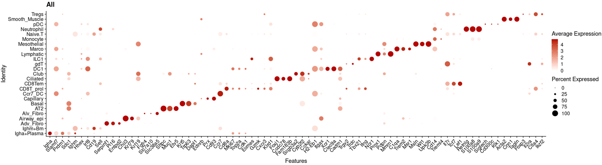

~~~r
scRNA_filter_merge$sample <- factor(scRNA_filter_merge$sample,levels=c("PBS","Ad5_prowt","STing"))
DimPlot(object = scRNA_filter_merge, reduction = "openTSNE",label=TRUE,repel=TRUE,group.by="v2_Cell_annotation",cols=pal) +NoLegend()+labs(title="openTSNE")
~~~

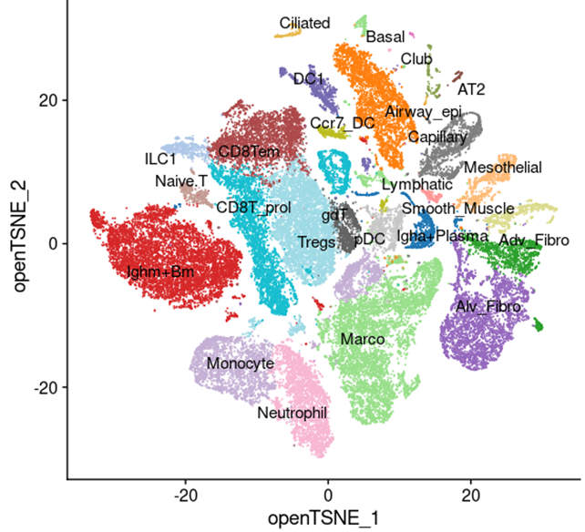

~~~R
Sel_sig <- c("Tmem173","Cgas")
All_sum <- as.data.frame(FetchData(object = scRNA_filter_merge, vars = c(Sel_sig,"v2_Cell_annotation","sample"),slot="data"))
my_pal <- jdb_palette("corona")
All_plots1 <- lapply(1:length(Sel_sig),function(x) {
  p1 <- ggbarplot(All_sum, x = "sample", y = Sel_sig[x],add = c("mean_se"),legend = "none",rotate=FALSE,color = "sample", fill = "sample", alpha = 1,title=paste0(Sel_sig[x],".exp"))+
        stat_summary(fun.y = mean, geom="point",colour="darkred", size=3) + stat_summary(fun = mean, geom = "line",aes(group = 1),col = "red",size=1)+NoLegend()+
        theme(axis.text.x  = element_text(angle=45, vjust=1,hjust = 1))
  return(p1)
  })
CombinePlots(c(All_plots1),nrow=1)
~~~

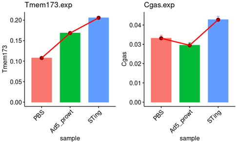

~~~R
Idents(scRNA_filter_merge) <- scRNA_filter_merge$sample
scRNA_filter_merge_PBS <- subset(scRNA_filter_merge,idents=c("PBS"))
scRNA_filter_merge_Ad5_prowt <- subset(scRNA_filter_merge,idents=c("Ad5_prowt"))
scRNA_filter_merge_STing <- subset(scRNA_filter_merge,idents=c("STing"))
all.obj <- list(scRNA_filter_merge_STing)
names(all.obj) <- c("STing")
require(mixtools)
All_plot <- lapply(1:length(all.obj),function(file) {
    all.obj.BMD <- all.obj[[file]]
    speci_raw <- FetchData(object = all.obj.BMD, vars = c("Tmem173"),slot="data")
    mixmdl <- normalmixEM(speci_raw$Tmem173, arbvar = FALSE, epsilon = 1e-03)
    x <- with(mixmdl,seq(min(x)-2,max(x)+2,len=1000)) 
    pars <- with(mixmdl,data.frame(comp=colnames(posterior), mu, sigma,lambda))
    em.df <- data.frame(x=rep(x,each=nrow(pars)),pars) 
    em.df$y <- with(em.df,lambda*dnorm(x,mean=mu,sd=sigma)) 
    plot <- ggplot(data.frame(x=mixmdl$x),aes(x,y=..density..)) + geom_histogram(fill=NA,color="black",bins=100)+ labs(title=paste0("Tmem173.in.",names(all.obj)[file]))+
    geom_polygon(data=em.df,aes(x,y,fill=comp),color="grey50", alpha=0.5)+ scale_fill_discrete("Component\nMeans",labels=format(em.df$mu,digits=3))+ theme_classic()
    return(plot)
    })
CombinePlots(All_plot,nrow=1)
~~~

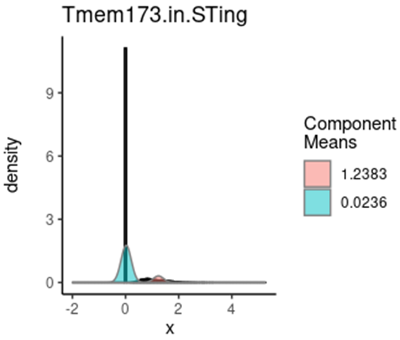

~~~r
lapply(1:length(all.obj),function(file) {
    all.obj.BMD <- all.obj[[file]]
    speci_raw <- FetchData(object = all.obj.BMD, vars = c("Tmem173"),slot="data")
    mixmdl <- normalmixEM(speci_raw$Tmem173, arbvar = FALSE, epsilon = 1e-03)
    x <- with(mixmdl,seq(min(x)-2,max(x)+2,len=1000)) 
    pars <- with(mixmdl,data.frame(comp=colnames(posterior), mu, sigma,lambda))
    return(min(pars["mu"]))
    })

all_group <- lapply(1:length(all.obj),function(file) {
    all.obj.BMD <- all.obj[[file]]
    speci_raw <- FetchData(object = all.obj.BMD, vars = c("Tmem173"),slot="data")
    mixmdl <- normalmixEM(speci_raw$Tmem173, arbvar = FALSE, epsilon = 1e-03)
    x <- with(mixmdl,seq(min(x)-2,max(x)+2,len=1000)) 
    pars <- with(mixmdl,data.frame(comp=colnames(posterior), mu, sigma,lambda))
    speci_raw$sgGroup <- "Pos"
    speci_raw$sgGroup[speci_raw$Tmem173 <= min(pars["mu"])] <- "Neg"
    message(min(pars["mu"]))
    return(speci_raw)
    })
all_group <- do.call(rbind,all_group)

scRNA_filter_merge$Tmem173_classify <- all_group[rownames(scRNA_filter_merge[[]]),"sgGroup"]
table(scRNA_filter_merge$sample,scRNA_filter_merge$Tmem173_classify)

filter_Cells1 <- rownames(scRNA_filter_merge[[]])[scRNA_filter_merge$sample %in% c("PBS") & scRNA_filter_merge$Tmem173_classify %in% c("Neg")]
filter_Cells2 <- rownames(scRNA_filter_merge[[]])[scRNA_filter_merge$sample %in% c("Ad5_prowt") & scRNA_filter_merge$Tmem173_classify %in% c("Neg")]
filter_Cells3 <- rownames(scRNA_filter_merge[[]])[scRNA_filter_merge$sample %in% c("STing") & scRNA_filter_merge$Tmem173_classify %in% c("Pos")]
filter_Cells <- c(filter_Cells1,filter_Cells2,filter_Cells3)
scRNA_filter_merge1 <- subset(scRNA_filter_merge,cells=setdiff(rownames(scRNA_filter_merge[[]]),filter_Cells3))

reticulate::use_python("/usr/local/python3.8/bin/python3.8", required=T)
library(reticulate)
library(ReductionWrappers)
library(s2a)
scRNA_filter_merge1.v1 <- scRNA_filter_merge1 %>%NormalizeData(verbose = FALSE) %>%
FindVariableFeatures(selection.method = "vst", nfeatures = 4000) %>% ScaleData(verbose = TRUE)
scRNA_filter_merge1.v1 <- scRNA_filter_merge1.v1 %>% RunPCA(npcs = 30, verbose = FALSE) %>% RunUMAP(dims = 1:25) %>%
FindNeighbors(dims = 1:25) %>% DoopenTSNE(reduction_save = "openTSNE",dims_use = 1:25)
mcsaveRDS(scRNA_filter_merge1.v1,"./projects/HWQ/scOmics/output/scRNA_filter_merge1.Sting.clean.rds",mc.cores=20)
~~~

~~~r
scRNA_filter_merge <- mcreadRDS("./projects/HWQ/scOmics/output/scRNA_filter_merge1.Sting.clean.rds",mc.cores=20)
plot <- DimPlot(object = scRNA_filter_merge, reduction = "openTSNE",label=FALSE,repel=FALSE,group.by="v2_Cell_annotation",cols=col) +labs(title="openTSNE")
ggsave("./projects/HWQ/scOmics/output/scRNA1_legend.svg", plot=plot,width = 7, height = 4,dpi=300)
ggsave("./projects/HWQ/scOmics/output/scRNA1_legend.png", plot=plot,width = 7, height = 4,dpi=300)
~~~

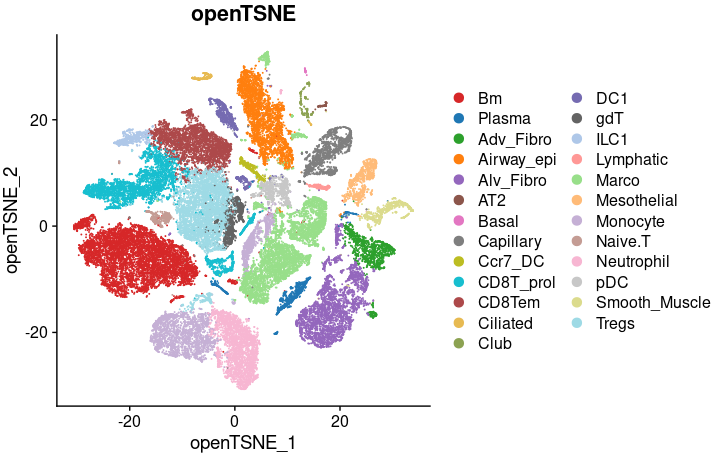

~~~r
scRNA_filter_merge1 <- scRNA_filter_merge
Sel_Group <- c("PBS","Wildtype","Sting")
All_plot <- lapply(1:length(Sel_Group),function(x) {
    scRNA_filter_merge1$new_anno5 <- as.character(scRNA_filter_merge1$v2_Cell_annotation)
    scRNA_filter_merge1$new_anno5[scRNA_filter_merge1$sample!=Sel_Group[x]] <- "OTS"
    scRNA_filter_merge1$new_anno5 <- factor(scRNA_filter_merge1$new_anno5,levels=c("OTS",CT))
    plot <- XY_DimPlot(scRNA_filter_merge1, reduction = 'openTSNE', label = FALSE,repel=FALSE, pt.size = .01,group.by="new_anno5",cols=col[levels(scRNA_filter_merge1$new_anno5)]) + 
    NoLegend()+labs(title=Sel_Group[x])
    return(plot)
    })
CombinePlots(All_plot,ncol=3)
plot <- CombinePlots(All_plot,ncol=3)
ggsave("./projects/HWQ/scOmics/output/scRNA1.svg", plot=plot,width = 12, height = 4,dpi=300)
ggsave("./projects/HWQ/scOmics/output/scRNA1.png", plot=plot,width = 12, height = 4,dpi=300)
~~~

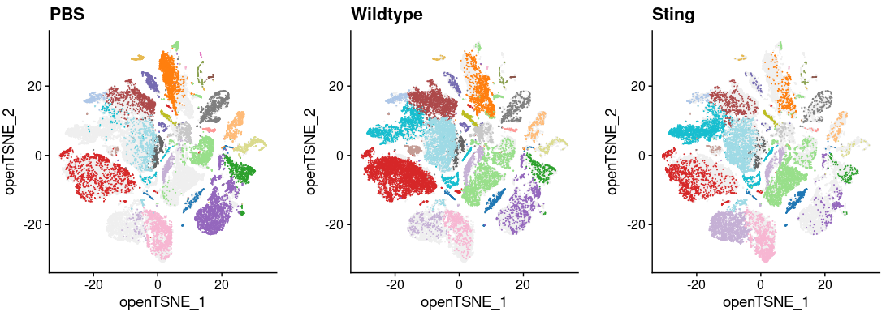

~~~R

Plasma <- c("Slamf7","Prdm1","Sdc1")
Bm <- c("Hhex", "Tie3","Irf8","Cd19","Sell")
Adv_Fibro <- c("Serpinf1", "Pi16", "Entpd2")
Airway_epi <- c("Chil3","Krt79","Krt19")
Alv_Fibro <- c("Fgfr4", "Slc7a10", "Slc38a5")
AT2 <- c("Sftpc", "Muc1", "Etv5")
Basal <- c("Krt5", "Trp63", "Dapl1")
Capillary <- c("Ednrb", "Prx", "Cd93")
Ccr7_DC <- c("Ccr7")
CD8T_prol <- c("Cd8a","Cd8b","Mki67", "Top2a", "Cdk1")
CD8Tem <- c("Eomes","Gzmk","Cxcr3","Fgfbp2","Klrd1")
Ciliated <- c("Foxj1", "Ccdc78", "Fam183b")
Club <- c("Scgb3a2", "Cyp2f2", "Cckar")
DC1 <- c("H2-Eb1","Itgax","Xcr1","Clec9a","Cadm1")
gdT <-  c("Trgv2", "Trdc")
ILC1 <- c("Tbx21", "Ifng","Ncr1")
Lymphatic <- c("Prox1", "Pdpn", "Mmrn1")
Marco <- c("C1qa", "Trem2", "Msr1")
Mesothelial <- c("Msln", "Wt1", "Upk3b")
Monocyte <- c("Cd14","Emr4",  "Treml4")
Naive.T <- c("Il7r","Ccr7","Tcf7","Sell","Lef1")
Neutrophil <- c("Retnlg", "S100a8", "S100a9")
pDC <- c("Siglech", "Cd300c", "Klk1")
Smooth_Muscle <- c("Acta2", "Cnn1", "Tagln")
Tregs <- c("Foxp3","Il2ra","Ctla4","Ikzf2")
All_gens <- c(Bm,Plasma,Adv_Fibro,Airway_epi,Alv_Fibro,AT2,Basal,Capillary,Ccr7_DC,CD8T_prol,CD8Tem,Ciliated,Club,DC1,gdT,ILC1,Lymphatic,Marco,Mesothelial,Monocyte,Naive.T,Neutrophil,pDC,Smooth_Muscle,Tregs)

tmp.seurat.obj <- scRNA_filter_merge
Idents(tmp.seurat.obj) <- as.character(tmp.seurat.obj$v2_Cell_annotation)
tmp.seurat.obj$v2_Cell_annotation <- as.character(tmp.seurat.obj$v2_Cell_annotation)
tmp.seurat.obj$v2_Cell_annotation <- gsub("[+]","_",tmp.seurat.obj$v2_Cell_annotation)
table(tmp.seurat.obj$v2_Cell_annotation)
Idents(tmp.seurat.obj) <- tmp.seurat.obj$v2_Cell_annotation
group <- unique(tmp.seurat.obj$v2_Cell_annotation)
All_gsva_seura_ <- lapply(1:length(group),function(x) {
    sel_tmp_sub <- subset(tmp.seurat.obj,idents=group[x])
    if (ncol(sel_tmp_sub) < 50) {if (ncol(sel_tmp_sub) < 50) {nbin=ncol(sel_tmp_sub) } else {nbin=50}} else {nbin=50}
    sel_tmp_sub_DS <- pseudo_bulk_seurat_mean_random(seurat_obj=sel_tmp_sub,num_split=nbin,seed.use=1,slot="data",prefix=paste0(group[x]),assay="RNA")
    metadata <- data.frame(cell_type=rep(group[x],nbin),group=c(rep(group[x],nbin)),row.names=colnames(sel_tmp_sub_DS))
    sel_tmp_seurat <- CreateSeuratObject(counts = sel_tmp_sub_DS,assay = 'RNA',project = 'RNA',min.cells = 0,meta.data = metadata)
    message(group[x], " is done")
    return(sel_tmp_seurat)
    })
All_gsva_seura <- merge(x = All_gsva_seura_[[1]], y = All_gsva_seura_[c(2:length(All_gsva_seura_))])
order <- gsub("[+]","_",CT)
All_gsva_seura$cell_type <- factor(All_gsva_seura$cell_type,levels=order)
mcsaveRDS(All_gsva_seura,"./projects/HWQ/scOmics/output/scRNA_filter_merge1.Sting.clean.DS.rds",mc.cores=20)
~~~

~~~R
All_gsva_seura <- mcreadRDS("./projects/HWQ/scOmics/output/scRNA_filter_merge1.Sting.clean.DS.rds",mc.cores=20)
All_gens <- All_gens[All_gens%in% rownames(All_gsva_seura)]
pdf("./projects/HWQ/scOmics/output/scRNA1_heatmap.pdf",height=14)
XY_heatmap(seurat_obj=All_gsva_seura,group="cell_type",genes=All_gens,all_num=FALSE,new_names=NULL,labels_rot=90,
  assay_sel="RNA",color=colorRampPalette(brewer.pal(10, "RdBu"))(101),min_and_max_cut=1,show_row_names=TRUE,mark_gene=NULL,label_size=0,scale=TRUE)
dev.off()
~~~

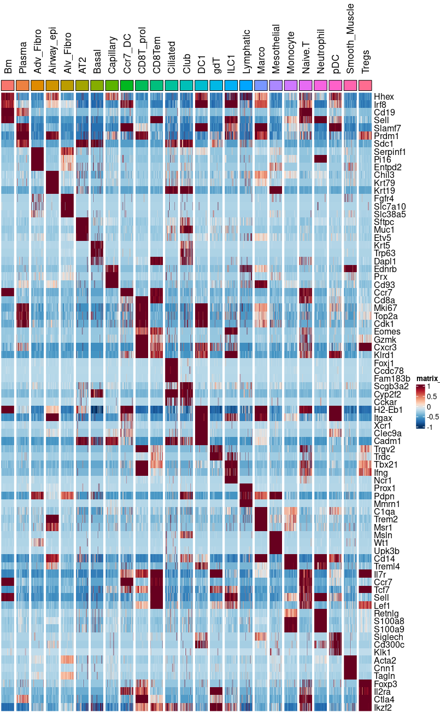

~~~r\
CT <- c("Bm","Plasma","Adv_Fibro","Airway_epi","Alv_Fibro","AT2",
    "Basal","Capillary","Ccr7_DC","CD8T_prol","CD8Tem","Ciliated","Club","DC1","gdT","ILC1","Lymphatic",
    "Marco","Mesothelial","Monocyte","Naive.T","Neutrophil","pDC","Smooth_Muscle","Tregs")
pal <- jdb_palette("corona")
pal <- pal[c(2,1,3:length(CT))]
names(pal) <- CT
col <- c(pal,"#efefef")
names(col)[length(col)] <- "OTS"
Sel_sig <- c("Tmem173")
All_sum <- as.data.frame(FetchData(object = scRNA_filter_merge, vars = c(Sel_sig,"v2_Cell_annotation","sample"),slot="data"))
o <- All_sum %>% dplyr::group_by(!!!syms(c("v2_Cell_annotation"))) %>% dplyr::summarise(Tmem173 = mean(Tmem173)) %>% as.data.frame(stringsAsFactors = FALSE)
o <- o[order(o$Tmem173,decreasing=TRUE),]
All_sum$v2_Cell_annotation <- factor(All_sum$v2_Cell_annotation,levels=o$v2_Cell_annotation)
All_plots1 <- lapply(1:length(Sel_sig),function(x) {
  p1 <- ggbarplot(All_sum, x = "v2_Cell_annotation", y = Sel_sig[x],add = c("mean_se"),legend = "none",rotate=FALSE,color = "v2_Cell_annotation", 
    fill = "v2_Cell_annotation", alpha = 1,title=paste0(Sel_sig[x],".exp"))+
    NoLegend()+theme(axis.text.x  = element_text(angle=45, vjust=1,hjust = 1))+geom_hline(yintercept = c(0.2),linetype=2, size = 0.5)+scale_color_manual(values = col, guide = "none") +scale_fill_manual(values = col, guide = "none")
  return(p1)
  })
CombinePlots(c(All_plots1),nrow=1)
plot <- CombinePlots(c(All_plots1),nrow=1)
ggsave("./projects/HWQ/scOmics/output/scRNA1_Tmem173.barplot.svg", plot=plot,width = 5, height = 4,dpi=300)
~~~

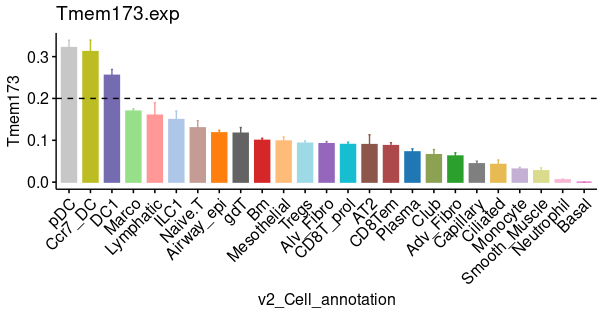

~~~R
library(Nebulosa)
aa <- jdb_palette("brewer_yes")
plot_density(scRNA_filter_merge1, c("Tmem173"), slot = NULL, joint = FALSE, reduction = "openTSNE",dims = c(1, 2), method = c("ks"), adjust = 1, size = 1, shape = 16, combine = TRUE) +scale_colour_gradientn(colours = colorRampPalette(aa)(100))
plot <- plot_density(scRNA_filter_merge1, c("Tmem173"), slot = NULL, joint = FALSE, reduction = "openTSNE",dims = c(1, 2), method = c("ks"), adjust = 1, size = 1, shape = 16, combine = TRUE) +scale_colour_gradientn(colours = colorRampPalette(aa)(100))
ggsave("./projects/HWQ/scOmics/output/scRNA1_Tmem173.exp.svg", plot=plot,width = 5, height = 4,dpi=300)
ggsave("./projects/HWQ/scOmics/output/scRNA1_Tmem173.exp.png", plot=plot,width = 5, height = 4,dpi=300)
~~~

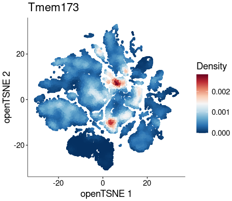

~~~r
Sel_sig <- c("Tmem173")
All_sum <- as.data.frame(FetchData(object = scRNA_filter_merge, vars = c(Sel_sig,"v2_Cell_annotation","sample"),slot="data"))
All_sum1 <- All_sum[All_sum$v2_Cell_annotation %in% c("Ccr7_DC","DC1","pDC"),]
All_plots1 <- lapply(1:length(Sel_sig),function(x) {
  p1 <- ggbarplot(All_sum1, x = "sample", y = Sel_sig[x],add = c("mean_se"),legend = "none",rotate=FALSE,
    color = "v2_Cell_annotation", fill = "v2_Cell_annotation", alpha = 1,title=paste0(Sel_sig[x],".exp"),facet.by="v2_Cell_annotation",scales="free",ncol=3)+
        NoLegend()+stat_compare_means(comparisons =list(c("PBS","Wildtype"),c("PBS","Sting"),c("Wildtype","Sting")), method = "wilcox.test",label.y=c(0.1,0.15,0.2))+
        theme(axis.text.x  = element_text(angle=45, vjust=1,hjust = 1))+scale_color_manual(values = col, guide = "none") +scale_fill_manual(values= col, guide = "none")
  return(p1)
  })
CombinePlots(c(All_plots1),nrow=1)
plot <- CombinePlots(c(All_plots1),nrow=1)
ggsave("./projects/HWQ/scOmics/output/scRNA1_Tmem173.DC.barplot.svg", plot=plot,width = 5, height = 4,dpi=300)
~~~

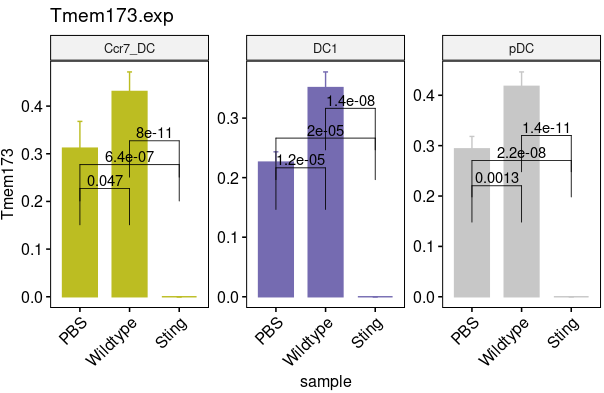

~~~r
scRNA_filter_merge1_markers <- mcreadRDS("./projects/HWQ/scOmics/output/scRNA_filter_merge_markers.sample.rds")
STING_SIGNALING <- ALL_GSEA_GMT2[ALL_GSEA_GMT2$ont %in% c("REACTOME_STING_MEDIATED_INDUCTION_OF_HOST_IMMUNE_RESPONSES","ISHIKAWA_STING_SIGNALING"),]
Sel_g <- c("Tmem173","Tbk1","Ifna1","Ifnb1","Irf3","Irf7","Isg15","Mx1","Oas1a","Oas1b","Ifit1","Cxcl10","Ccl5","Il6","Tnf","Cgas")
STING_SIGNALING <- c(Sel_g,STING_SIGNALING$gene)
STING_SIGNALING <- intersect(STING_SIGNALING,scRNA_filter_merge1_markers[scRNA_filter_merge1_markers$cluster=="Ad5_prowt","gene"])
sort(STING_SIGNALING)
speci_raw <- FetchData(object = scRNA_filter_merge, vars = STING_SIGNALING,slot="data")
scRNA_filter_merge[["STING_SIGNALING"]] <- (rowSums(speci_raw))/length(STING_SIGNALING)

Sel_sig <- c("STING_SIGNALING")
All_sum <- as.data.frame(FetchData(object = scRNA_filter_merge, vars = c(Sel_sig,"v2_Cell_annotation","sample"),slot="data"))
All_sum1 <- All_sum[All_sum$v2_Cell_annotation %in% c("Ccr7_DC","DC1","pDC"),]
All_plots1 <- lapply(1:length(Sel_sig),function(x) {
  p1 <- ggbarplot(All_sum1, x = "sample", y = Sel_sig[x],add = c("mean_se"),legend = "none",rotate=FALSE,
    color = "v2_Cell_annotation", fill = "v2_Cell_annotation", alpha = 1,title=paste0(Sel_sig[x],".exp"),facet.by="v2_Cell_annotation",scales="free",ncol=3)+
        NoLegend()+stat_compare_means(comparisons =list(c("PBS","Wildtype"),c("PBS","Sting"),c("Wildtype","Sting")),label = "p.signif", method = "t.test",label.y=c(0.1,0.15,0.2))+
        theme(axis.text.x  = element_text(angle=45, vjust=1,hjust = 1))+scale_color_manual(values = col, guide = "none") +scale_fill_manual(values = col, guide = "none")
  return(p1)
  })
CombinePlots(c(All_plots1),nrow=1)
plot <- CombinePlots(c(All_plots1),nrow=1)
ggsave("./projects/HWQ/scOmics/output/scRNA1_STING_SIGNALING.DC.barplot.svg", plot=plot,width = 5, height = 4,dpi=300)
~~~

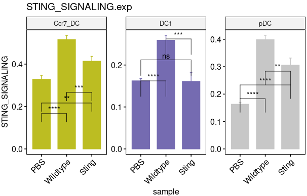

~~~R

scRNA_filter_merge <- mcreadRDS("./projects/HWQ/scOmics/output/scRNA_filter_merge1.Sting.clean.rds",mc.cores=20)
Idents(scRNA_filter_merge) <- scRNA_filter_merge$v2_Cell_annotation
only_B <- subset(scRNA_filter_merge,idents=c("Plasma","Bm"))
only_B$tcr.cdr3s_aa <- as.character(only_B$tcr.cdr3s_aa)
only_B$tcr.cdr3s_aa[is.na(only_B$tcr.cdr3s_aa)] <- "OTS"
only_B$v2_Cell_annotation <- factor(only_B$v2_Cell_annotation,levels=c("Plasma","Bm"))
Idents(only_B) <- only_B$sample

sample <- c("PBS","Wildtype","Sting")
All_info1_ <- lapply(1:length(sample),function(x) {
    tmp.obj <- subset(only_B,idents=sample[x])
    Subtype_pro <- as.data.frame(table(tmp.obj$v2_Cell_annotation))
    Subtype_pro$fraction = Subtype_pro$Freq
    BCR_anno <- FetchData(object = tmp.obj, vars = c("v2_Cell_annotation","sample","bcr.clonotype_id"),slot="data")
    BCR_anno <- subset(BCR_anno,bcr.clonotype_id!="OTS")
    sel_type1 <- unique(as.character(BCR_anno$v2_Cell_annotation))
    bcr_clonotype_all <- lapply(1:length(sel_type1), function(x) {
      sel_data <- subset(BCR_anno,v2_Cell_annotation==sel_type1[x])
      bcr_clonotype <- as.data.frame(table(sel_data$bcr.clonotype_id))
      bcr_clonotype$v2_Cell_annotation <- sel_type1[x]
      message(x, " is done")
      return(bcr_clonotype)
      })
    bcr_clonotype_all <- do.call(rbind,bcr_clonotype_all)
    BCR_pro <- as.data.frame(table(bcr_clonotype_all$v2_Cell_annotation))
    rownames(Subtype_pro) <- Subtype_pro$Var1
    rownames(BCR_pro) <- BCR_pro$Var1
    All_info <- data.frame(proportion=Subtype_pro$Freq,diversity=BCR_pro[rownames(Subtype_pro),]$Freq,cell.type=rownames(Subtype_pro))
    All_info1 <- as.data.frame(reshape::melt(All_info))
    All_info1$value[All_info1$variable=="proportion"] <- (-1)*All_info1$value[All_info1$variable=="proportion"]
    Subtype_pro <- Subtype_pro[order(Subtype_pro$Freq,decreasing=FALSE),]
    All_info1$cell.type <- factor(All_info1$cell.type,levels=as.character(Subtype_pro$Var1))
    All_info1$sample <- sample[x]
    return(All_info1)
    })
All_info1 <- do.call(rbind,All_info1_)
All_info1$sample <- factor(All_info1$sample,levels=c("PBS","Wildtype","Sting"))
ggplot(All_info1, aes(x=cell.type, y=value, fill=variable)) +geom_bar(stat="identity")+geom_line(aes(x=cell.type, y=value, group = variable),size = 0.5) + 
geom_point(aes(x=cell.type, y=value),size = 1.5)+theme_bw()+coord_flip()+facet_wrap(~sample,ncol=3)
~~~

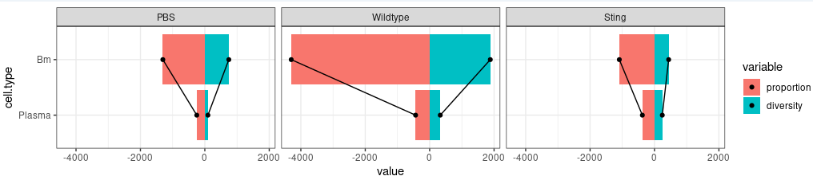

~~~R
sample <- c("PBS","Wildtype","Sting")
All_info1_ <- lapply(1:length(sample),function(x) {
    tmp.obj <- subset(only_B,idents=sample[x])
    BCR_anno <- FetchData(object = tmp.obj, vars = c("v2_Cell_annotation","sample","bcr.clonotype_id"),slot="data")
    BCR_anno <- subset(BCR_anno,bcr.clonotype_id!="OTS")
    Freq.BCR <- as.data.frame(table(BCR_anno$bcr.clonotype_id))
    rownames(Freq.BCR) <- Freq.BCR$Var1
    Freq.BCR <- Freq.BCR[order(Freq.BCR$Freq,decreasing=TRUE),]
    Freq.BCR$type <- "Single"
    Freq.BCR[Freq.BCR$Freq >1 & Freq.BCR$Freq <=5 ,"type"] <- "Small"
    Freq.BCR[Freq.BCR$Freq >5 & Freq.BCR$Freq <=20 ,"type"] <- "Medium"
    Freq.BCR[Freq.BCR$Freq >20 ,"type"] <- "Large"
    BCR_anno$type <- as.character(Freq.BCR[as.character(BCR_anno$bcr.clonotype_id),"type"])
    BCR_anno1 <- as.data.frame(table(BCR_anno$type))
    BCR_anno1$sample <- sample[x]
    return(BCR_anno1)
    })
All_info1 <- do.call(rbind,All_info1_)
All_info1$sample <- factor(All_info1$sample,levels=c("PBS","Wildtype","Sting"))
All_info1$Var1 <- factor(All_info1$Var1,levels=c("Large","Medium","Small","Single"))
pal <- colorRampPalette(jdb_palette("brewer_spectra"))(4)
names(pal) <- c("Single","Small","Medium","Large")
library(ggalluvial)
p1 <- ggplot(All_info1, aes(x = sample, y = Freq, fill = Var1, stratum = Var1, alluvium = Var1)) + geom_stratum(width = 0.75) + geom_flow(alpha = 0.5) + 
theme_classic() + theme(axis.text.x  = element_text(angle=45, vjust=1,hjust = 1)) +labs(x = '', y = 'num',title="BCR.colony")+
scale_color_manual(values = pal, guide = "none") +scale_fill_manual(values = pal)

Idents(scRNA_filter_merge) <- scRNA_filter_merge$v2_Cell_annotation
only_T <- subset(scRNA_filter_merge,idents=c("CD8Tem"))
Idents(only_T) <- only_T$sample
sample <- c("PBS","Wildtype","Sting")
All_info1_ <- lapply(1:length(sample),function(x) {
    tmp.obj <- subset(only_T,idents=sample[x])
    TCR_anno <- FetchData(object = tmp.obj, vars = c("v2_Cell_annotation","sample","tcr.clonotype_id"),slot="data")
    TCR_anno <- subset(TCR_anno,tcr.clonotype_id!="OTS")
    Freq.TCR <- as.data.frame(table(TCR_anno$tcr.clonotype_id))
    rownames(Freq.TCR) <- Freq.TCR$Var1
    Freq.TCR <- Freq.TCR[order(Freq.TCR$Freq,decreasing=TRUE),]
    Freq.TCR$type <- "Single"
    Freq.TCR[Freq.TCR$Freq >1 & Freq.TCR$Freq <=5 ,"type"] <- "Small"
    Freq.TCR[Freq.TCR$Freq >5 & Freq.TCR$Freq <=20 ,"type"] <- "Medium"
    Freq.TCR[Freq.TCR$Freq >20 ,"type"] <- "Large"
    TCR_anno$type <- as.character(Freq.TCR[as.character(TCR_anno$tcr.clonotype_id),"type"])
    TCR_anno1 <- as.data.frame(table(TCR_anno$type))
    TCR_anno1$sample <- sample[x]
    return(TCR_anno1)
    })
All_info1 <- do.call(rbind,All_info1_)
All_info1$sample <- factor(All_info1$sample,levels=c("PBS","Wildtype","Sting"))
All_info1$Var1 <- factor(All_info1$Var1,levels=c("Large","Medium","Small","Single"))
pal <- colorRampPalette(jdb_palette("brewer_spectra"))(4)
names(pal) <- c("Single","Small","Medium","Large")
library(ggalluvial)
p2 <- ggplot(All_info1, aes(x = sample, y = Freq, fill = Var1, stratum = Var1, alluvium = Var1)) + geom_stratum(width = 0.75) + geom_flow(alpha = 0.5) + 
theme_classic() + theme(axis.text.x  = element_text(angle=45, vjust=1,hjust = 1)) +labs(x = '', y = 'num',title="TCR.colony")+
scale_color_manual(values = pal, guide = "none") +scale_fill_manual(values = pal)
plot_grid(p1,p2)
plot <- plot_grid(p1,p2)
ggsave("./projects/HWQ/scOmics/output/scRNA1_TCR_BCR.svg", plot=plot,width = 8, height = 4,dpi=300)
~~~

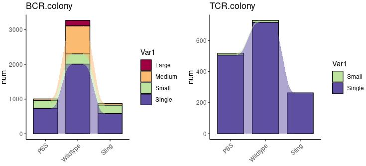

~~~R

ALL_GSEA_GMT <- read.gmt("./workshop/database/msigdb.v7.1.symbols.gmt")
ALL_GSEA_GMT1 = ALL_GSEA_GMT %>% mutate(mouse_gene = convert_human_to_mouse_symbols(gene))
ALL_GSEA_GMT2 <- ALL_GSEA_GMT1[,c("term","mouse_gene")]
colnames(ALL_GSEA_GMT2) <- c("ont","gene")
All.DEG_only <- mcreadRDS("./projects/HWQ/scOmics/output/All.DEG_only.rds",mc.cores=20)
only_B.UP <- All.DEG_only[All.DEG_only$cluster=="Ad5_prowt" & All.DEG_only$cell_type %in% c("Igha_Plasma","Ighm_Bm"),]
only_B.DN <- All.DEG_only[All.DEG_only$cluster=="PBS" & All.DEG_only$cell_type %in% c("Igha_Plasma","Ighm_Bm"),]
only_B.UP.g <- setdiff(only_B.UP$gene,only_B.DN$gene)

IGB_PRODUCTION <- ALL_GSEA_GMT2[ALL_GSEA_GMT2$ont %in% c("GO_IMMUNOGLOBULIN_PRODUCTION","GO_IMMUNOGLOBULIN_SECRETION"),] 
B_CELL_ACT <- ALL_GSEA_GMT2[ALL_GSEA_GMT2$ont %in% c("GO_B_CELL_ACTIVATION"),]
PLASMA <- ALL_GSEA_GMT2[ALL_GSEA_GMT2$ont %in% c("MORI_PLASMA_CELL_UP","TARTE_PLASMA_CELL_VS_B_LYMPHOCYTE_UP","TARTE_PLASMA_CELL_VS_PLASMABLAST_UP"),]
PLASMA <- intersect(intersect(only_B.UP.g,PLASMA$gene),rownames(only_B))
speci_raw <- FetchData(object = only_B, vars = PLASMA,slot="data")
only_B[["PLASMA"]] <- (rowSums(speci_raw))/length(PLASMA)
B_CELL_ACT <- intersect(intersect(only_B.UP.g,B_CELL_ACT$gene),rownames(only_B))
speci_raw <- FetchData(object = only_B, vars = B_CELL_ACT,slot="data")
only_B[["B_CELL_ACT"]] <- (rowSums(speci_raw))/length(B_CELL_ACT)
IGB_PRODUCTION <- intersect(intersect(only_B.UP.g,IGB_PRODUCTION$gene),rownames(only_B))
speci_raw <- FetchData(object = only_B, vars = IGB_PRODUCTION,slot="data")
only_B[["IGB_PRODUCTION"]] <- (rowSums(speci_raw))/length(IGB_PRODUCTION)

Sel_sig <- c("IGB_PRODUCTION","B_CELL_ACT","PLASMA")
All_sum <- as.data.frame(FetchData(object = only_B, vars = c(Sel_sig,"sample","v2_Cell_annotation"),slot="data"))
All_sum <- All_sum[All_sum$v2_Cell_annotation %in% c("Plasma","Bm"),]
All_sum$IGB_PRODUCTION <- (All_sum$IGB_PRODUCTION-mean(All_sum$IGB_PRODUCTION))/(max(All_sum$IGB_PRODUCTION)-min(All_sum$IGB_PRODUCTION))
All_sum$B_CELL_ACT <- (All_sum$B_CELL_ACT-mean(All_sum$B_CELL_ACT))/(max(All_sum$B_CELL_ACT)-min(All_sum$B_CELL_ACT))
All_sum$PLASMA <- (All_sum$PLASMA-mean(All_sum$PLASMA))/(max(All_sum$PLASMA)-min(All_sum$PLASMA))
All_sum$IGB_PRODUCTION[All_sum$IGB_PRODUCTION > 0.2] <- 0.2
All_sum$IGB_PRODUCTION[All_sum$IGB_PRODUCTION< -0.2]<- -0.2
All_sum$PLASMA[All_sum$PLASMA > 0.3] <- 0.3
All_sum$PLASMA[All_sum$PLASMA< -0.3]<- -0.3
All_sum <- All_sum[order(All_sum$PLASMA,decreasing=FALSE),]

sel_group <- c("PBS","Wildtype","Sting")
All_plot <- lapply(1:length(sel_group),function(x) {
    plot <- ggscatter(subset(All_sum,sample==sel_group[x]), x = "B_CELL_ACT", 
        y = "PLASMA",color="IGB_PRODUCTION",alpha=0.5,fullrange = TRUE,rug = TRUE,size=0.5,legend="none")+
    labs(title=paste0("B cells in ",sel_group[x]))+
    geom_vline(xintercept = 0, color = 'lightgrey', size = 0.5,linetype=2) +
    geom_hline(yintercept = 0, color = 'lightgrey', size = 0.5,linetype=2) + theme_classic()+
    geom_density_2d(alpha=0.4,colour="#BB2933", size = 1) +
    scale_colour_gradientn(colours = colorRampPalette(aa)(100))+  xlim(-0.5,0.5)+ylim(-0.3,0.3)+scale_alpha_continuous(range = c(0.5, 0.5))
    return(plot)
    })
CombinePlots(All_plot,ncol=3)
plot <- CombinePlots(All_plot,ncol=3)
ggsave("./projects/HWQ/scOmics/output/scRNA1_B.sig.svg", plot=plot,width = 18, height = 4,dpi=300)
ggsave("./projects/HWQ/scOmics/output/scRNA1_B.sig.png", plot=plot,width = 18, height = 4,dpi=300)
~~~

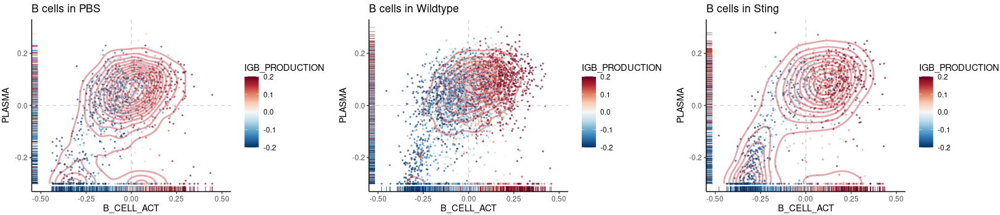

