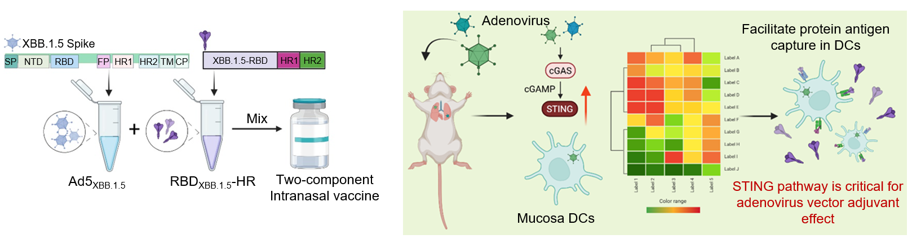

# **Intranasal vaccine combining adenovirus and trimeric subunit protein provides superior immunity against SARS-CoV-2 Omicron variant** 

This page recorded the codes and data used and mentioned in [*xxx*](XXX). And you could downloaded this paper by clicking [here](pdf/XXX)



Abstract

Mucosal immunity provides efficient protection against upper-airway infections, limiting viral shedding and transmission. However, currently no nasal spray COVID-19 vaccines are approved by WHO for global use. Here we develop a two-component intranasal vaccine that combines an adenovirus vector expressing the spike protein of the XBB.1.5 variant (Ad5XBB.1.5) with a self-assembled trimeric recombinant protein derived from the receptor binding domain (RBDXBB.1.5-HR), which elicits superior humoral and cellular immunity against XBB.1.5 variants compared to the individual component. It also provides protective immunity against live XBB.1.16 virus challenges in mice, preventing XBB.1.5 virus transmission in a hamster model. Notably, the activation of the STING signaling pathway in mucosal dendritic cells is essential for the adjuvant effect of the adenovirus vector. We also incorporate another trimeric protein from the BA.5 variant (RBDBA.5-HR), creating a three-component vaccine (Ad5XBB.1.5+RBDXBB.1.5-HR+RBDBA.5-HR) that shows enhanced broad-spectrum neutralization. The two-component vaccine demonstrates high tolerability and safety in human, inducing enhanced mucosal immunity and high levels of neutralizing antibodies in all participants. Our findings underscore this strategy for clinical COVID-19 intranasal vaccine development. 

# **1. Codes of analyzing and visualization**

**Introduction to Our Script Compilation for Analysis**

In our comprehensive analysis of antifungal treatment in the MMC cohort, we have organized our scripts into six distinct chapters. Each chapter focuses on a specific aspect of the analysis, enabling a detailed examination of different facets of antifungal treatment effects in IBD. Below is a guide to the content of each chapter:

- **[Chapter 0](Chapter0.md): Pre-processing of scRNA data**
  - Content: Initial processing steps for scRNA-seq, scTCR-seq, and scSpatial datasets, including data cleaning, normalization, and quality control.
  
- **[Chapter 1](Chapter1.md): scRNA-seq Analysis **
  - **Content:** Scripts for analyzing scRNA-seq data.
  


Each chapter contains detailed scripts, methodologies, and analyses relevant to the specific aspect of Intranasal vaccine. This structured approach allows researchers to navigate our comprehensive analysis with ease, enhancing their understanding of Intranasal vaccine.

# **2. Raw data download**

- **Description**: This section includes all the raw FASTQ files from our study. These files are crucial for in-depth data analysis and understanding the sequencing results from single-cell RNA and B-cell receptor,.

- **Download**: You can access and download these files from the [GEO GSE279004](https://www.ncbi.nlm.nih.gov/geo/query/acc.cgi?acc=GSE279004).

Below is a detailed annotation of the file structure and contents:

```shell
[ 512]  .
├── [ 512]  scBCR
│   ├── [3.6G]  PBS_scBCR_S1_L001_R1_001.fastq.gz
│   ├── [  68]  PBS_scBCR_S1_L001_R1_001.fastq.gz.md5
│   ├── [3.7G]  PBS_scBCR_S1_L001_R2_001.fastq.gz
│   ├── [  68]  PBS_scBCR_S1_L001_R2_001.fastq.gz.md5
│   ├── [2.9G]  Sting_scBCR_S1_L001_R1_001.fastq.gz
│   ├── [  70]  Sting_scBCR_S1_L001_R1_001.fastq.gz.md5
│   ├── [3.0G]  Sting_scBCR_S1_L001_R2_001.fastq.gz
│   ├── [  70]  Sting_scBCR_S1_L001_R2_001.fastq.gz.md5
│   ├── [3.1G]  Wildtype_scBCR_S1_L001_R1_001.fastq.gz
│   ├── [  73]  Wildtype_scBCR_S1_L001_R1_001.fastq.gz.md5
│   ├── [3.2G]  Wildtype_scBCR_S1_L001_R2_001.fastq.gz
│   └── [  73]  Wildtype_scBCR_S1_L001_R2_001.fastq.gz.md5
└── [ 512]  scRNA
    ├── [6.6G]  PBS_scRNA_S1_L001_R1_001.fastq.gz
    ├── [  68]  PBS_scRNA_S1_L001_R1_001.fastq.gz.md5
    ├── [ 15G]  PBS_scRNA_S1_L001_R2_001.fastq.gz
    ├── [  68]  PBS_scRNA_S1_L001_R2_001.fastq.gz.md5
    ├── [6.7G]  Sting_scRNA_S1_L001_R1_001.fastq.gz
    ├── [  70]  Sting_scRNA_S1_L001_R1_001.fastq.gz.md5
    ├── [ 16G]  Sting_scRNA_S1_L001_R2_001.fastq.gz
    ├── [  70]  Sting_scRNA_S1_L001_R2_001.fastq.gz.md5
    ├── [7.5G]  Wildtype_scRNA_S1_L001_R1_001.fastq.gz
    ├── [  73]  Wildtype_scRNA_S1_L001_R1_001.fastq.gz.md5
    ├── [ 17G]  Wildtype_scRNA_S1_L001_R2_001.fastq.gz
    └── [  73]  Wildtype_scRNA_S1_L001_R2_001.fastq.gz.md5

2 directories, 24 files
```

# **3. Processed Data Download**

## 3.1. XXX and XXX  Output

- **Description**: This section includes the output files from Cell Ranger, essential for the initial data processing and analysis of single-cell RNA and B-cell receptor data.
- **Download**: These files are available for access and download from the [GEO GSE279004](https://www.ncbi.nlm.nih.gov/geo/query/acc.cgi?acc=GSE279004).

Below is a detailed annotation of the file structure and contents:

```shell
[ 512]  .
├── [ 512]  scBCR
│   ├── [258K]  PBS_scBCR.tar.gz
│   ├── [  51]  PBS_scBCR.tar.gz.md5
│   ├── [275K]  Sting_scBCR.tar.gz
│   ├── [  53]  Sting_scBCR.tar.gz.md5
│   ├── [612K]  Wildtype_scBCR.tar.gz
│   └── [  56]  Wildtype_scBCR.tar.gz.md5
└── [ 512]  scRNA
    ├── [107M]  PBS_scRNA.tar.gz
    ├── [  51]  PBS_scRNA.tar.gz.md5
    ├── [104M]  Sting_scRNA.tar.gz
    ├── [  53]  Sting_scRNA.tar.gz.md5
    ├── [105M]  Wildtype_scRNA.tar.gz
    ├── [  56]  Wildtype_scRNA.tar.gz.md5
    ├── [553M]  scRNA.total.rds
    └── [  50]  scRNA.total.rds.md5

2 directories, 14 files
```

- Contents
  - Each `_RNA.tar.gz` file includes the filtered_feature_bc_matrix output and loupe file from the Cell Ranger count model.
  
  - Each `_BCR.tar.gz` file contains the filtered_contig_annotations.csv, clonotypes.csv, and loupe.vloupe files generated from the Cell Ranger BCR model.
  - R Data Files Generated in This Study

# **Citation**

Our paper has been published in [*XXX Journal*](https://chat.openai.com/c/xxxx). For further reference and details, you can access the publication at the provided link.

The raw data supporting the findings of this study can be downloaded from the following repositories:

- **GEO Database**: Access our dataset by visiting [GEO GSE279004](https://www.ncbi.nlm.nih.gov/geo/query/acc.cgi?acc=GSE279004). This link will take you directly to the dataset's page.